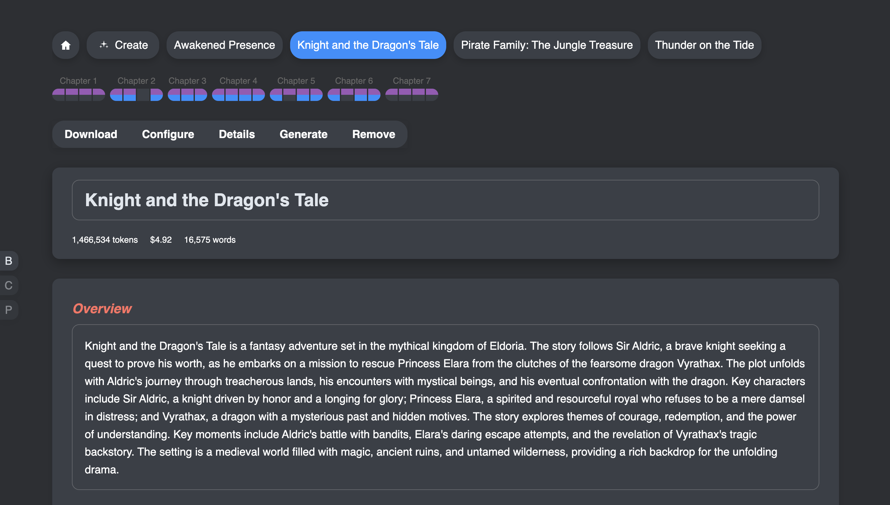

# [Inklify.io](https://inklify.io/)


Inklify is a comprehensive book creation application that uses models to streamline the writing and publishing process. It integrates text generation models for creating the outline and writing the book as well as audio models for narration, enabling authors to produce both written books and audio books. The web-based interface allows users to create and edit books, chapters, parts, and characters, while supporting reference uploads. Features include automatic chapter outlining, part generation, and export to DOCX and MP3 formats. Built with Node.js, Express, and Lit, Inklify requires configuration of OpenAI-compatible text and audio model providers via API keys for full functionality.

## Prerequisites

1. [git](https://git-scm.com/)
1. [nvm](https://www.nvmnode.com/guide/installation.html)
1. [node](https://nodejs.org/en)

## Getting Started

You can simply run the below command to get started or follow the (slightly) longer steps below.

```sh
curl -s https://raw.githubusercontent.com/megazear7/inklify/refs/heads/main/init.sh -o init.sh && chmod 744 init.sh && ./init.sh
```

Or the slightly longer version:

```sh
git clone https://github.com/megazear7/inklify.git
cd inklify
nvm use 22
npm run init
npm start
```

The cli will ask you a series of questions to initialize your system for running Inklify.
You need to have a text model provider and an audio model provider with urls and api keys ready.
Once complete, the `.env` file and the `data/app/index.json` files will be created and you
can run Inklify with `npm start`. You can also refer to the example files that are provided
if you want to set it up manually.



## Install

```sh
npm install
```

## Run

```sh
npm start
```

## Build

```sh
npm run build
```

## Fix & Lint

```sh
npm run lint
npm run fix
```
